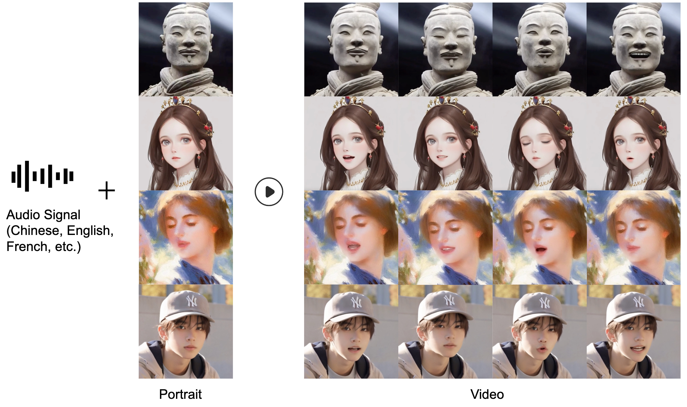

# LinguaLinker: Audio-Driven Portraits Animation with Implicit Facial Control Enhancement

    <a href="">Rui Zhang*</a>,

    <a href="https://github.com/fangyixiao18">Yixiao Fang*</a>,

    <a href="">Zhengnan Lu</a>,

    <a href="https://openreview.net/profile?id=~Pei_Cheng1">Pei Cheng</a>,

    <a href="">Zebiao Huang</a>,

    <a href="https://openreview.net/profile?id=~BIN_FU2">Bin Fu</a>

* Equal contributions

Official repository of "LinguaLinker: Audio-Driven Portraits Animation with Implicit Facial Control Enhancement".

    

# 🎞 Showcases

### Implicit Frequency Control
<table class="center">
<tr>
    <td> 👨:low 👄:high 👀:low </td>
    <td> 👨:low 👄:high 👀:high </td>
    <td> 👨:high 👄:low 👀:low </td>
    <td> 👨:high 👄:high 👀:high </td>
</tr>
<tr>
    <td colspan="4" width=100% style="border: none">
        <video controls loop src="https://github.com/user-attachments/assets/3831ad02-2390-47b5-8806-a196b5b3a6c7" muted="false"></video>
    </td>
</tr>
</table>

### Multilingual Results
<table class="center">
<tr>
    <td> Chinese Song </td>
    <td> French Song </td>
</tr>
<tr>
    <td width=50% style="border: none">
        <video controls loop src="https://github.com/user-attachments/assets/35627ce0-239a-4a1c-bcf8-7bae49ceff7a" muted="false"></video>
    </td>
    <td width=50% style="border: none">
        <video controls loop src="https://github.com/user-attachments/assets/ca62a759-0eaa-4382-be12-896504983a0c" muted="false"></video>
    </td>
</tr>
</table>

<table class="center">
<tr>
    <td> English Song </td>
    <td> Japanese Song </td>
</tr>
<tr>
    <td width=50% style="border: none">
        <video controls loop src="https://github.com/user-attachments/assets/8c37c63d-d28c-4234-85f6-068e09d3db3b" muted="false"></video>
    </td>
    <td width=50% style="border: none">
        <video controls loop src="https://github.com/user-attachments/assets/736f9452-f092-4483-a634-559da19aab87" muted="false"></video>
    </td>
</tr>
</table>

<table class="center">
<tr>
    <td> Chinese Talk </td>
    <td> English Talk </td>
</tr>
<tr>
    <td width=50% style="border: none">
        <video controls loop src="https://github.com/user-attachments/assets/05a7780a-4b0d-4e6b-b378-0e134504eb0f" muted="false"></video>
    </td>
    <td width=50% style="border: none">
        <video controls loop src="https://github.com/user-attachments/assets/d4181395-8036-4ca9-a8f5-ad5810fd3286" muted="false"></video>
    </td>
</tr>
</table>

More results are demonstrates in our [project page](https://ella-diffusion.github.io/).

# 🌟 Changelog

- **[2024.7.12]** Initial update
